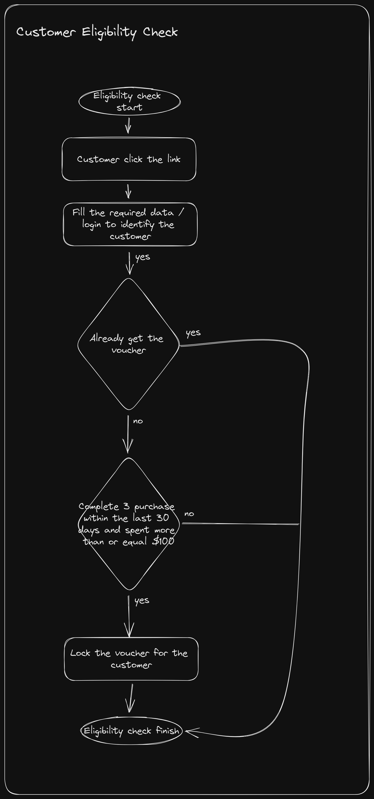
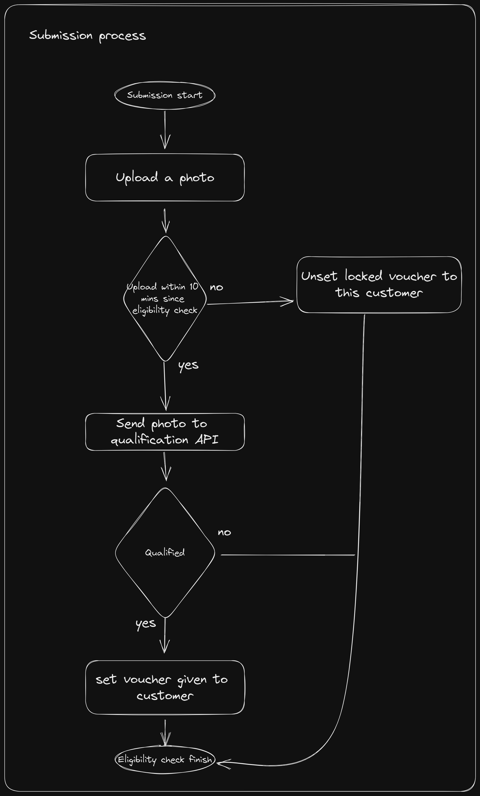

# AiChat Assesment
### Prerequisite
- PHP 8.0 or above
- MySQL 5.7+

### Setup
- Clone this project
- Run ``` composer install ```
- Create database **aichat_assessment_123**
- Run migration ```php artisan migrate```

### Run tests
- Run ``` run_test.sh ```

## Endpoint
- Eligibility Check
  - route: ``` /api/campaign/annyversary/check ```
  - method: **GET**
  - header:
    - Authorization: Bearer token
  - response:
    - json: 
    ```
    {
        "status": "ok"|"error",
        "message": string,
        "data": null
    }
    ```

- Submission
  - route: ``` /api/campaign/annyversary/submission ```
  - method: **POST**
  - header:
    - Authorization: Bearer token
  - request:
    - photo: file (maximum size: 2Mb)
  - response:
    - json:
    ```
    {
        "status": "ok"|"error",
        "message": string,
        "data": {
            "code": string
        }
    }
    ```

## Business Flow
- Eligibility <br>
  

- Submission <br>
  
